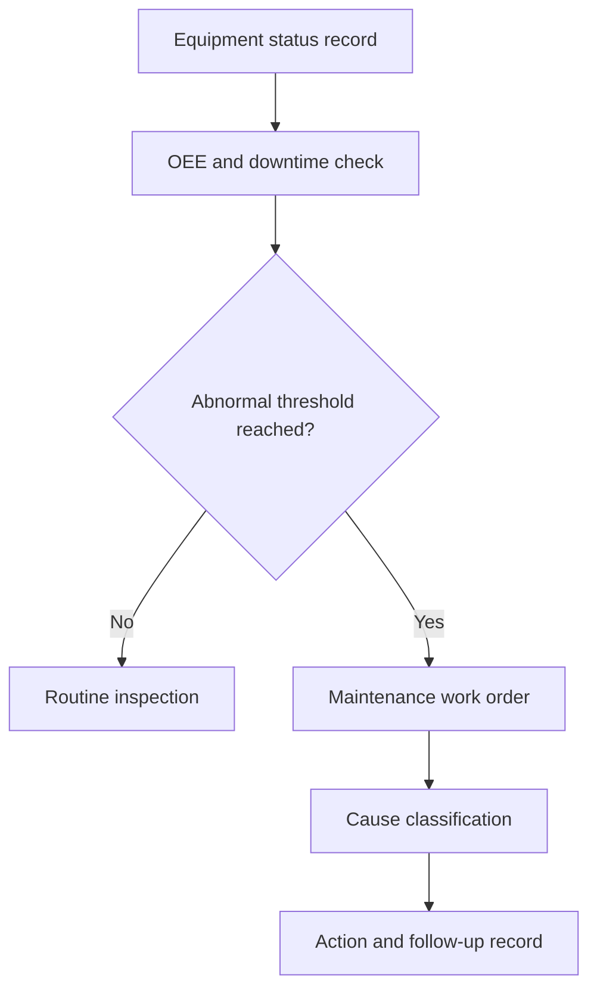

# Synthetic Maintenance Flow

This is a synthetic figure specification, not real factory evidence.

```mermaid
flowchart TD
    A[Equipment status record] --> B[OEE and downtime check]
    B --> C{Abnormal threshold reached?}
    C -- No --> D[Routine inspection]
    C -- Yes --> E[Maintenance work order]
    E --> F[Cause classification]
    F --> G[Action and follow-up record]
```
